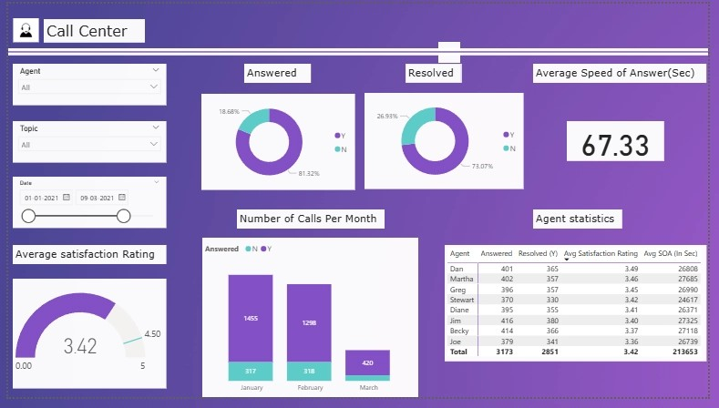

# Call Center Performance Analysis

## Project Overview

This project analyzes call center operations using Power BI to evaluate customer service performance, agent productivity, and operational efficiency. The dashboard provides management with insights to improve service quality and customer satisfaction.

---

## Business Problem

The organization needed visibility into call center performance to identify opportunities for improving customer satisfaction, reducing response times, and increasing call resolution rates.

---

## Dashboard

---

## Tools Used

- Power BI
- Data Visualization
- KPI Analysis
- Business Reporting

---

## Key Metrics

| KPI | Value |
|-------|---------|
| Average Satisfaction Rating | 3.42 / 5 |
| Average Speed of Answer | 67.33 Seconds |
| Answered Calls | 81.32% |
| Resolved Calls | 73.07% |

---

## Key Insights

### 1. Strong Call Answer Rate

- More than 81% of incoming calls were answered.
- This indicates good call handling capacity within the support team.

### 2. Resolution Rate Can Be Improved

- Approximately 73% of calls were successfully resolved.
- Nearly one-quarter of customer issues remained unresolved, creating an opportunity for process improvement.

### 3. Customer Satisfaction Is Moderate

- The average customer satisfaction score was 3.42 out of 5.
- Improvements in resolution quality and response speed could increase customer satisfaction.

### 4. Response Time Remains a Challenge

- The average speed of answer was 67.33 seconds.
- Long wait times may negatively impact customer experience.

### 5. Agent Performance Varies

- Agent statistics show differences in call handling, resolution rates, and satisfaction ratings.
- High-performing agents can serve as benchmarks for coaching and training programs.

### 6. Call Volume Declined Across the Quarter

- Call volumes decreased from January to March.
- Further investigation is needed to determine whether this reflects improved service efficiency or changing customer demand.

---

## Recommendations

- Reduce average response times through workforce optimization.
- Implement coaching programs for lower-performing agents.
- Analyze unresolved calls to identify recurring customer issues.
- Monitor customer satisfaction trends regularly.
- Use top-performing agents' practices as benchmarks for team development.

---

## Conclusion

The dashboard highlights strong call answer rates but identifies opportunities to improve resolution rates, customer satisfaction, and response times. These improvements can enhance overall service quality and operational efficiency.

---

## Author

Madhumitha Balajayabalan

Business Analyst | Power BI | KPI Reporting | Data Analytics# Call-Center-Performance-Analysis
